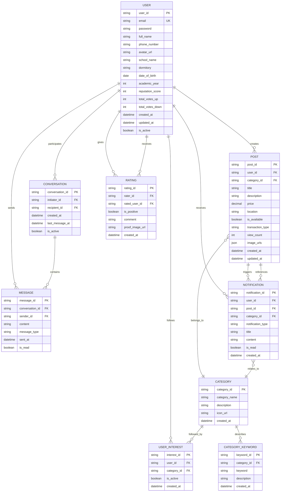

# 📊 Sơ đồ ERD - Dự án ShareIn

## Mô tả dự án
**ShareIn** là nền tảng giúp sinh viên trong trường/ký túc xá chia sẻ, trao đổi và mua bán đồ cũ một cách an toàn, minh bạch và hiệu quả.

---

## 🗂️ Sơ đồ ERD (Entity-Relationship Diagram)

---

## 📋 Mô tả các Entity chính

### 1️⃣ USER (Người dùng)
- Quản lý hồ sơ sinh viên, thêm `date_of_birth`, `academic_year` để hỗ trợ xác thực và gợi ý phù hợp.
- Dữ liệu uy tín (`reputation_score`, `total_votes_up`, `total_votes_down`) phản ánh mức độ đáng tin cậy.

### 2️⃣ POST (Bài đăng)
- Lưu thông tin đồ dùng được chia sẻ, kết hợp `transaction_type` (ENUM: `CHO_MIEN_PHI`, `DOI_DO`, `BAN_RE`).
- `image_urls` (JSON array) gom toàn bộ ảnh thay thế bảng `POST_IMAGE`; bỏ `expired_at` và `display_order`.

### 3️⃣ CATEGORY & CATEGORY_KEYWORD
- `CATEGORY` định nghĩa danh mục; `CATEGORY_KEYWORD` quản lý từ khóa cụ thể của từng danh mục cùng mô tả.
- Hỗ trợ tìm kiếm chính xác và gửi thông báo theo sở thích.

### 4️⃣ CONVERSATION & MESSAGE
- `CONVERSATION` chỉ liên hệ giữa người khởi tạo và người nhận; bỏ liên kết trực tiếp tới `POST`.
- `MESSAGE` chứa nội dung chat, thuộc một cuộc hội thoại.

### 5️⃣ NOTIFICATION
- Gửi cảnh báo sự kiện (bài đăng mới, tin nhắn mới, đánh giá mới) gắn với người dùng và tùy chọn thêm bài đăng/danh mục liên quan.

### 6️⃣ USER_INTEREST
- Ghi nhận danh mục mà sinh viên theo dõi để tạo thông báo cá nhân hóa.

### 7️⃣ RATING
- Ghi nhận đánh giá giữa người dùng với nhau; thêm `proof_image_url` làm bằng chứng.
- Không còn liên kết tới `POST`; tập trung đánh giá uy tín cá nhân.

---

## 🔗 Các mối quan hệ chính
| Quan hệ | Loại | Mô tả |
|---------|------|-------|
| USER - POST | 1:N | Một người dùng tạo nhiều bài đăng |
| POST - CATEGORY | N:1 | Bài đăng thuộc một danh mục |
| USER - USER_INTEREST | 1:N | Người dùng theo dõi nhiều danh mục |
| CATEGORY - USER_INTEREST | 1:N | Danh mục được nhiều người theo dõi |
| CATEGORY - CATEGORY_KEYWORD | 1:N | Danh mục có nhiều từ khóa mô tả |
| USER - CONVERSATION | 1:N | Mỗi người tham gia nhiều cuộc hội thoại |
| CONVERSATION - MESSAGE | 1:N | Một cuộc hội thoại có nhiều tin nhắn |
| USER - NOTIFICATION | 1:N | Người dùng nhận nhiều thông báo |
| USER - RATING | 1:N | Người dùng đánh giá nhiều người khác |

---

## 🎯 Ánh xạ tính năng MVP với ERD
| Tính năng | Entity liên quan |
|-----------|-----------------|
| Đăng tin nhanh | USER, POST, CATEGORY, CATEGORY_KEYWORD |
| Tìm kiếm & lọc danh mục | POST, CATEGORY, CATEGORY_KEYWORD |
| Chat trực tiếp | USER, CONVERSATION, MESSAGE |
| Thông báo theo quan tâm | USER_INTEREST, NOTIFICATION, CATEGORY |
| Đánh giá uy tín (Vote) | USER, RATING |

---

✍️ _Được cập nhật cho dự án ShareIn - L01_MobileApp - 10/2025_

